# Loto App Frontend

## Description

Loto App Frontend est une application web développée avec Angular pour gérer et participer à des loteries. Ce projet permet aux utilisateurs de s'inscrire, de se connecter, de créer des loteries, et de participer à des tirages. L'application est une application monopage (SPA) qui propose des interfaces utilisateur et administrateur pour gérer les différentes fonctionnalités.

## Table des matières

- [Description](#)
- [Installation](#)
- [Technologies](#)
- [Structure du projet](#)
- [Note](#)

## Installation

### Prérequis

Assurez-vous d'avoir les éléments suivants installés sur votre machine :

- **Node.js** (v14 ou plus récent)
- **npm** (v6 ou plus récent)
- **Angular CLI** (v12 ou plus récent)

### Étapes

1. Clonez le dépôt sur votre machine locale.
2. Accédez au dossier du projet.
3. Installez les dépendances du projet en utilisant votre gestionnaire de paquets (npm).
4. Lancez le serveur de développement pour voir l'application sur `http://localhost:4200/`.

## Technologies

Le projet utilise les technologies suivantes :

- **Angular** : Framework pour développer des applications web dynamiques.
- **TypeScript** : Langage qui étend JavaScript avec du typage statique.
- **Prettier** : Outil de formatage de code pour garantir une cohérence dans le style.
- **Bootstrap** : Bibliothèque CSS pour créer des interfaces réactives.
- **RxJS** : Bibliothèque pour la programmation réactive, utilisée pour gérer les événements asynchrones.

## Structure du projet

```plaintext
lotoAppfrontend/
├── src/                            # Répertoire principal contenant tout le code source de l'application Angular.
│   ├── __mocks__/                  # Contient des mockups pour les tests unitaires (par exemple, simuler le HTML pour les composants).
│   │   └── htmlMock.js
│   ├── app/                        # Dossier principal pour les composants et la logique de l'application.
│   │   ├── app.component.*         # Fichiers liés au composant principal (CSS, HTML, tests et logique TypeScript).
│   │   ├── app.config.ts           # Fichier de configuration pour l'application.
│   │   ├── app.routes.ts           # Configuration des routes principales de l'application.
│   │   ├── config/                 # Sous-dossier pour la configuration des APIs et autres services.
│   │   │   ├── api-admin.ts        # Configuration de l'API admin.
│   │   │   ├── api-auth.ts         # Configuration de l'API d'authentification.
│   │   │   ├── api-contact.ts      # Configuration de l'API contact.
│   │   │   └── api-user.ts         # Configuration de l'API utilisateur.
│   │   ├── constants/              # Contient des fichiers de constantes pour une gestion centralisée des variables.
│   │   │   ├── pages.constants.ts  # Constantes pour les pages de l'application.
│   │   │   ├── ressources/         # Contient les ressources liées aux différentes fonctionnalités (admin, user, etc.).
│   │   │   │   ├── admin/          # Ressources liées aux fonctionnalités admin (CRUD, login, gestion des participants, etc.).
│   │   │   │   └── user/           # Ressources liées aux utilisateurs (connexion, déconnexion, gestion de compte, etc.).
│   │   ├── core/                   # Composants et services essentiels de l'application.
│   │   │   ├── auth-interceptor.ts # Intercepteur HTTP pour ajouter des tokens d'authentification aux requêtes.
│   │   │   └── spiner-interceptor.ts # Gestion des spinners (chargement) dans l'application.
│   │   ├── guards/                 # Contient des gardiens (guards) pour protéger les routes.
│   │   │   ├── auth.guard.ts       # Garde d'authentification pour protéger l'accès aux pages.
│   │   │   └── token-expiration.guard.ts # Garde pour vérifier l'expiration des tokens.
│   │   ├── pages/                  # Dossier contenant les composants associés aux différentes pages de l'application.
│   │   │   ├── admin/              # Pages et services liés à l'administration.
│   │   │   └── user-page/          # Pages et services spécifiques aux utilisateurs connectés.
│   │   ├── shared/                 # Composants partagés entre plusieurs parties de l'application (footer, navbar, etc.).
│   │   └── assets/                 # Ressources statiques telles que les images, icônes, etc.
│   ├── index.html                  # Fichier HTML principal, point d'entrée de l'application.
│   ├── main.ts                     # Point d'entrée TypeScript qui initialise l'application Angular.
│   └── styles.css                  # Styles globaux pour l'application.
├── angular.json                    # Fichier de configuration pour Angular CLI, gestion des builds et des configurations spécifiques.
├── package.json                    # Liste des dépendances du projet ainsi que les scripts de build, test, etc.
├── README.md                       # Documentation principale du projet.
└── tsconfig.json                   # Configuration de TypeScript pour le projet.
```

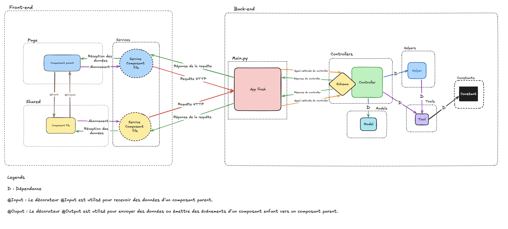

## Utilisation

1. **Démarrez l'application :**

```bash
   npm start
```
## Fonctionnalités

| **Fonctionnalité**                                    | **Utilisateur**           | **Administrateur** |
| ----------------------------------------------------- | ------------------------- | ------------------ |
| Créer un compte                                       | Oui                       | Oui                |
| Modifier les informations du compte                   | Oui                       | Oui                |
| Modifier le mot de passe                              | Oui                       | Oui                |
| Participer à un tirage                                | Oui                       | Non                |
| Consulter les résultats d'un tirage                   | Oui                       | Oui                |
| Consulter l'historique des tirages                    | Oui                       | Non                |
| Recevoir des notifications                            | Oui (par email si activé) | Non                |
| Générer un ticket de récompense (si gain)             | Oui                       | Non                |
| Créer un tirage                                       | Non                       | Oui                |
| Modifier les informations d'un tirage                 | Non                       | Oui                |
| Supprimer un tirage                                   | Non                       | Oui                |
| Ajouter/Supprimer des utilisateurs dans un tirage     | Non                       | Oui                |
| Définir les résultats gagnants d'un tirage            | Non                       | Oui                |
| Consulter tous les tirages                            | Non                       | Oui                |
| Contacter l'assistance                                | Oui                       | Oui                |


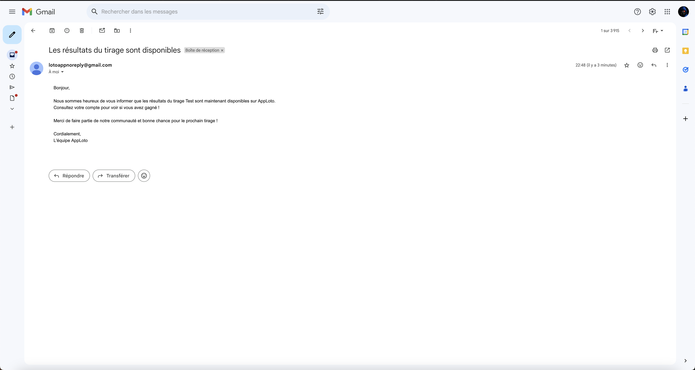

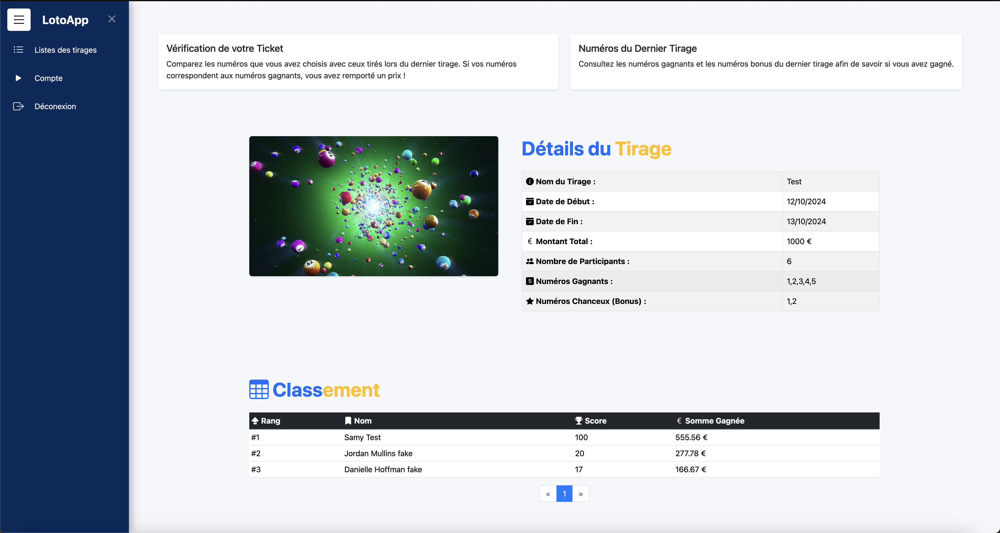

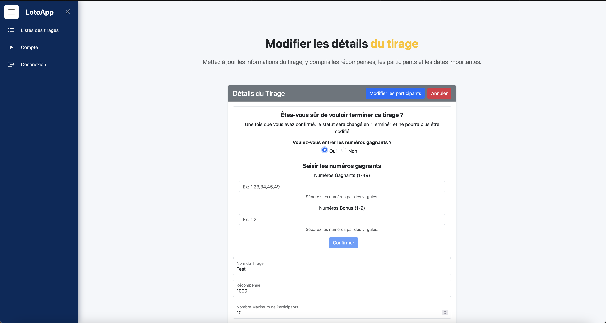

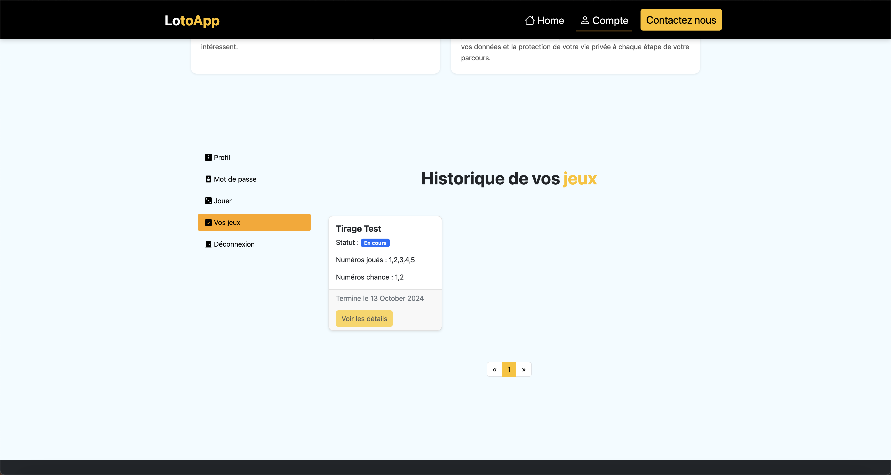

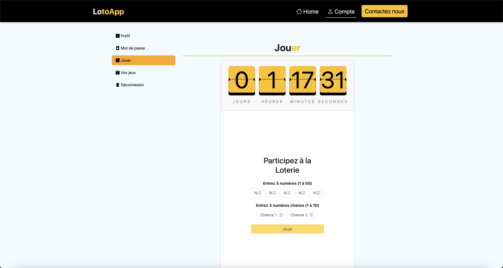

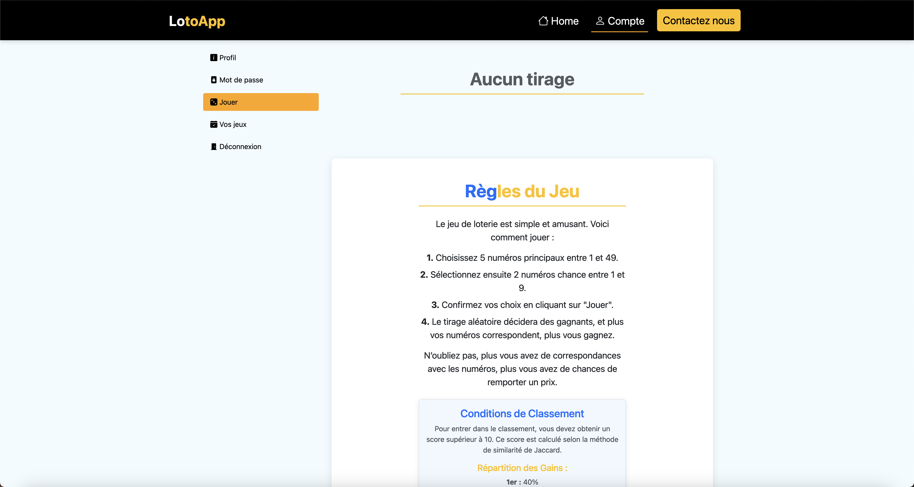

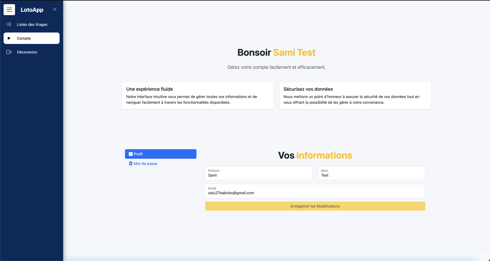

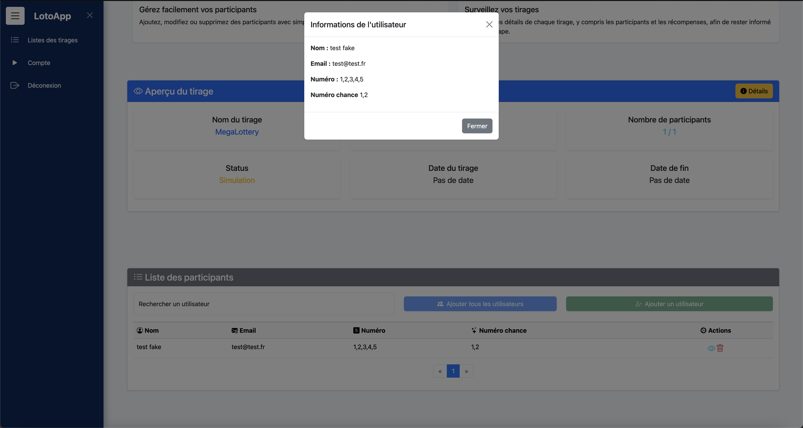

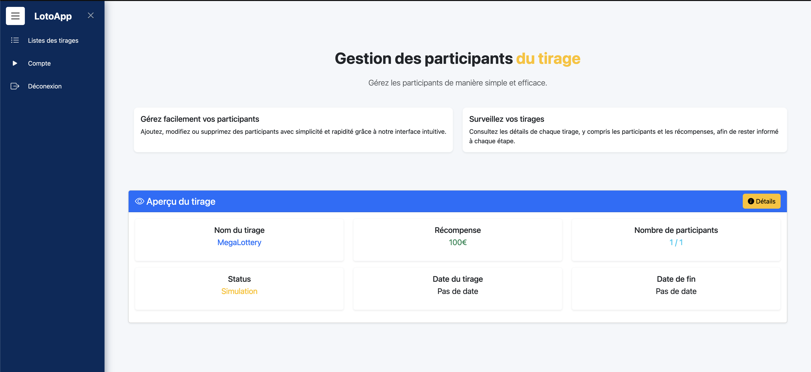

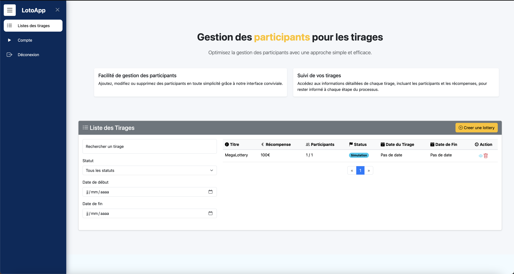

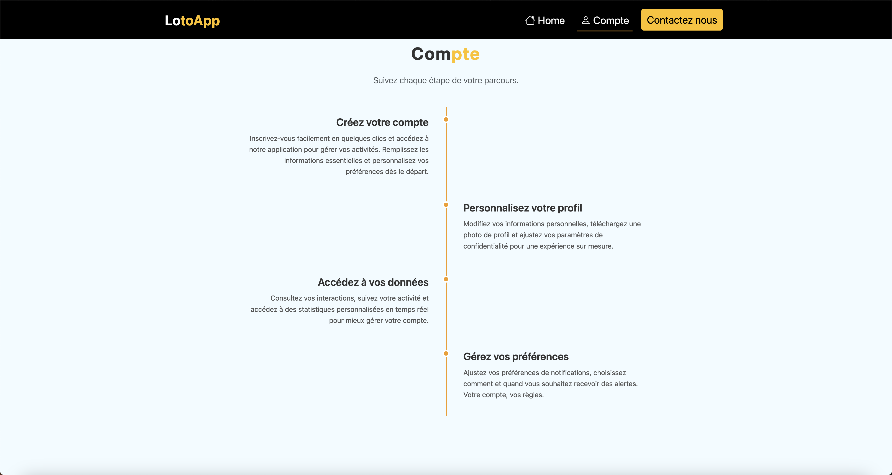

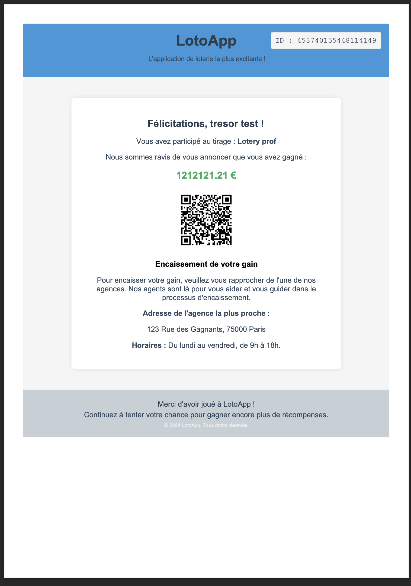

## Note

Ce projet a été développé dans le cadre de la formation universitaire BUT3 FA Informatique,
pour le module "Qualité de développement". Il s'agit d'un projet pratique permettant
de mettre en application les bonnes pratiques de développement et de gestion de projet.
